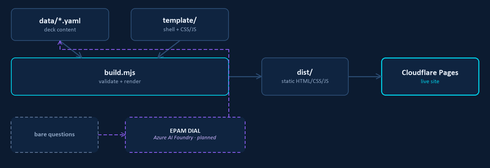

# Site generator — specification

Status: **implemented**, matches the code in [`scripts/build.mjs`](../../scripts/build.mjs) as of this writing. This is the project's spec-driven functionality — written and used to check the implementation against, not written after the fact to describe it.



## 1. Purpose

Turn one or more **decks** — structured question/answer content, as YAML — into a static, interactive learning site: search, per-question expand/collapse, a difficulty filter, a confidence-tracking progress bar, and a light/dark theme toggle. Output is plain HTML/CSS/JS with no server and no framework, deployable to any static host.

## 2. Non-goals

- **Not a CMS.** There's no UI for authoring content — decks are hand-written or agent-written YAML files.
- **Not a Markdown pipeline.** Content fields carry a small set of trusted inline HTML (see §3.3), not Markdown.
- **Not a general-purpose site generator.** One page type (a deck) plus one auto-generated index. No blog, no arbitrary page templates.
- **Content correctness is out of scope.** The generator validates *shape* (required fields present, non-empty sections/tiers/questions) — it has no way to check that an answer is factually right.

## 3. Input contract

### 3.1 Location

Every `data/*.yaml` file is one deck. The filename (minus extension) is not used — the deck's own `id` field decides its output path.

### 3.2 Deck schema

```yaml
id: interview-prep              # required — becomes the URL path: /interview-prep/
title: "..."                    # required — hero <h1> and <title>
short_title: "..."               # optional — sidebar brand subtitle; falls back to title
description: "..."               # optional — hero paragraph (plain text, HTML-escaped)
footer_note: "<b>...</b> ..."    # optional — raw HTML, rendered in <footer>
sections:                        # required, non-empty
  - id: s1                       # required — anchor id, e.g. #s1
    accent: s1                   # optional — one of s1..s5 (a CSS color variable); cycles if omitted
    title: "..."                 # required — plain text
    summary: "..."               # optional — plain text, shown under the section title
    nav_tag: "..."               # optional — short descriptive tail in the sidebar ("pipeline, eval, failure modes");
                                  #   the leading "N questions" part is always computed, never authored
    diagram: "<svg>...</svg>"    # optional — raw SVG, rendered as-is inside a <figure>
    diagram_caption: "..."       # optional — plain text, shown under the diagram
    tiers:                       # required, non-empty
      - name: Foundational        # required — display label
        filter_value: Foundational # optional — value used by the difficulty-filter buttons; defaults to name
        questions:                # required, non-empty
          - id: "1.1"              # required
            question: "..."        # required — plain text
            lead: "..."             # required — the one-sentence "15-second version"; trusted inline HTML
            body: "..."             # optional — the rest of the answer; trusted inline HTML (see 3.3)
```

### 3.3 Trusted inline HTML

`lead`, `body`, `diagram`, and `footer_note` are inserted into the page **unescaped**. They may contain `<p>`, `<strong>`, `<em>`, `<code>`, `<ul>/<ol>/<li>`, `<table>`, `<div class="box trap|tip">`, `<div class="terms">`, and similar markup already used by the template's stylesheet. This is a deliberate scope decision, not an oversight: decks are authored by the project owner (by hand or via an LLM assistant working under the owner's review), not submitted by untrusted third parties. `question`, `title`, `summary`, `nav_tag`, and tier/deck names are plain text and are always HTML-escaped by the generator.

## 4. Output contract

Running the build produces:

```
dist/
  assets/styles.css     # copied from template/styles.css, unchanged
  assets/app.js         # copied from template/app.js, unchanged
  index.html            # auto-generated: one card per deck, linking to it
  <deck-id>/index.html  # one per deck in data/, e.g. interview-prep/index.html
```

Every deck page computes its own header stats (question count, section count, distinct tier count, table+diagram count) from the data — none of those numbers are authored by hand, so they can't drift out of sync with the content.

## 5. Build behavior

`npm run build` (`node scripts/build.mjs`):

1. Reads every `data/*.yaml`, parses it, and **validates required fields** (§3.2) — a missing field fails the whole build with a message naming the deck, section, tier, or question at fault, rather than producing a broken page.
2. Wipes and recreates `dist/`.
3. Copies the template's CSS/JS unchanged.
4. Renders each deck through `template/shell.html` via plain string substitution (`{{TOKEN}}` placeholders) — no templating engine, no build-time dependency beyond `js-yaml`.
5. Writes the deck index page.

Exit code is non-zero on any validation failure, so this is safe to run as a CI/deploy gate.

## 6. Acceptance criteria

| # | Criterion | How it's checked |
|---|---|---|
| 1 | Every question has an `id`, `question`, and `lead` | `build.mjs` validation — fails the build |
| 2 | Every section has a non-empty `tiers` array; every tier has a non-empty `questions` array | `build.mjs` validation — fails the build |
| 3 | `npm run build` exits `0` on valid input and produces `dist/<deck>/index.html` for every deck in `data/` | `build.mjs`, run manually before each deploy (see [`.claude/skills/publish-content`](../../.claude/skills/publish-content/), once written) |
| 4 | Header stats (question/section/tier/table+diagram counts) match the actual content | computed at build time, not authored — can't drift |
| 5 | The generated `interview-prep` deck is functionally identical to the original `ai-interview-prep.html` (search, filter, expand/collapse, confidence checkboxes + progress bar, theme toggle) | verified manually in-browser during development (see §8); not an automated test |
| 6 | The one-time migration (`scripts/migrate-html-to-yaml.mjs`) extracts a question count matching each section's own nav copy | built into the migration script — warns, does not fail, since a human should look before trusting a fresh extraction |

## 7. Known limitations

- **No persisted progress.** Neither the original `ai-interview-prep.html` nor this generator saves confidence-checkbox state anywhere (no `localStorage`) — progress resets on reload. This matches the original's actual behavior, not the earlier assumption in project notes that it was saved; adding persistence would be a small, separate change to `template/app.js` if wanted.
- **No automated visual-regression test.** Fidelity to the original was checked once, by hand, in a browser (§8). A future content or template change could silently break rendering; nothing in `npm run build` would catch that today.
- **`scripts/migrate-html-to-yaml.mjs` is a one-time bootstrap tool**, not part of the ongoing pipeline. It exists to extract `interview-prep` from the original hand-built HTML without retyping 44 questions; every deck after that is authored directly as YAML.
- **No answer-generation step yet.** A deck that starts as bare questions (no answers) currently needs them written by hand or by an LLM assistant working outside this pipeline. A `generateAnswer(question)` hook — and pointing it at an EPAM DIAL / Azure AI Foundry endpoint — is future work, not yet started; see the project README's status list.

## 8. Verification performed

During development, the built `interview-prep` deck was served locally and checked in-browser against the acceptance criteria above: header stats rendered correctly (44/5/3/26, matching the original), theme toggle switched palettes correctly, a question expanded on click and its lead paragraph became visible, ticking a confidence checkbox updated the progress bar (1/44 → 2.27%), and searching "quantization" correctly filtered to the 5 matching questions across 2 sections while hiding the other 3 sections. This was a manual check, not a script — see §7 for the gap that leaves.
